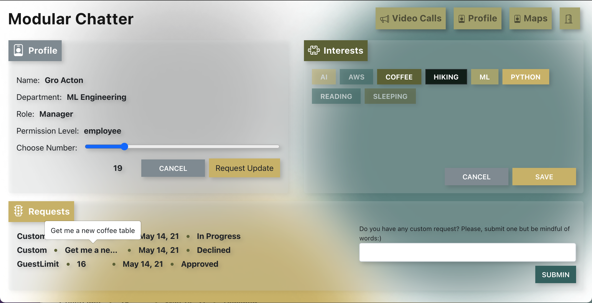
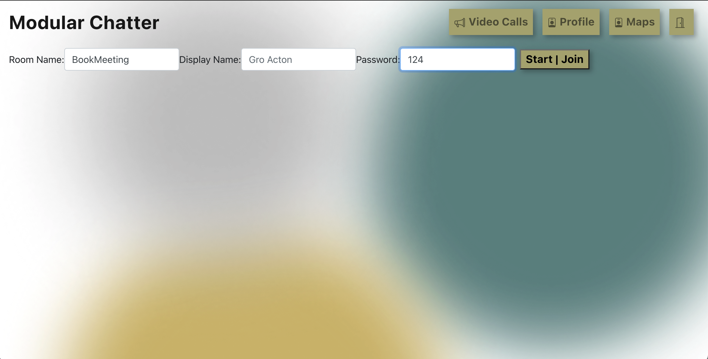
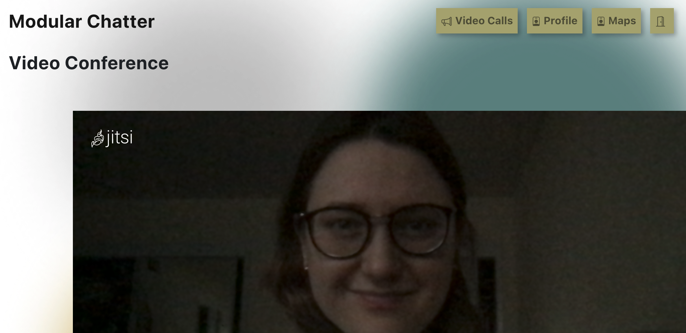
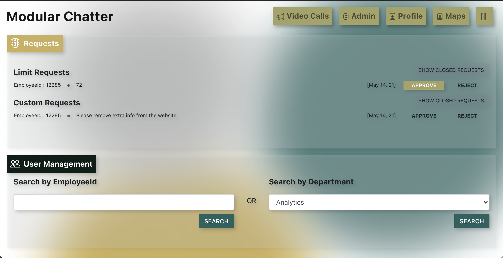
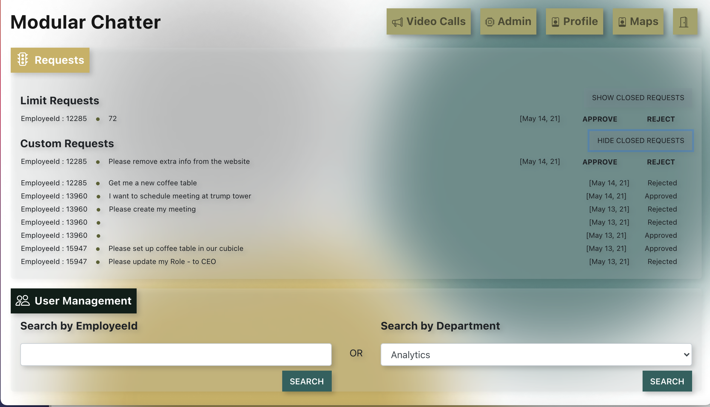
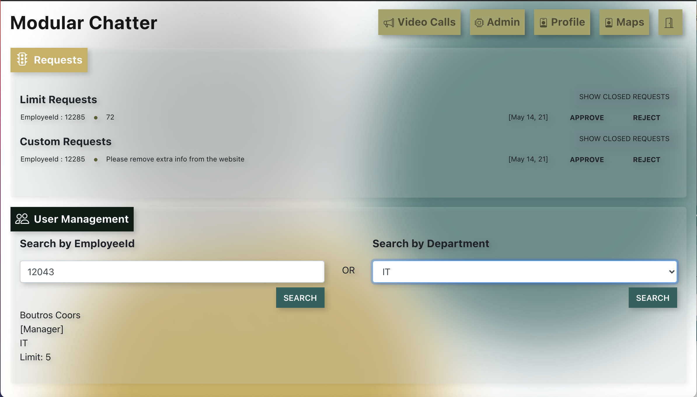
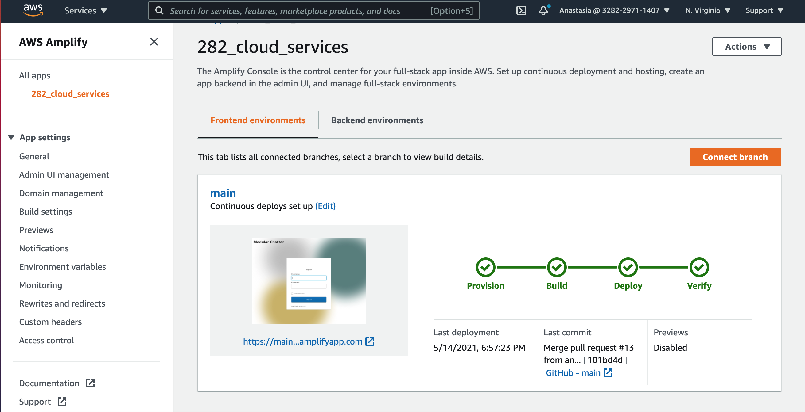
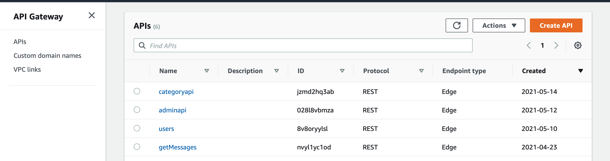
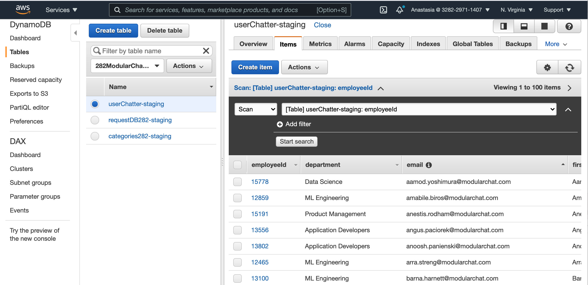
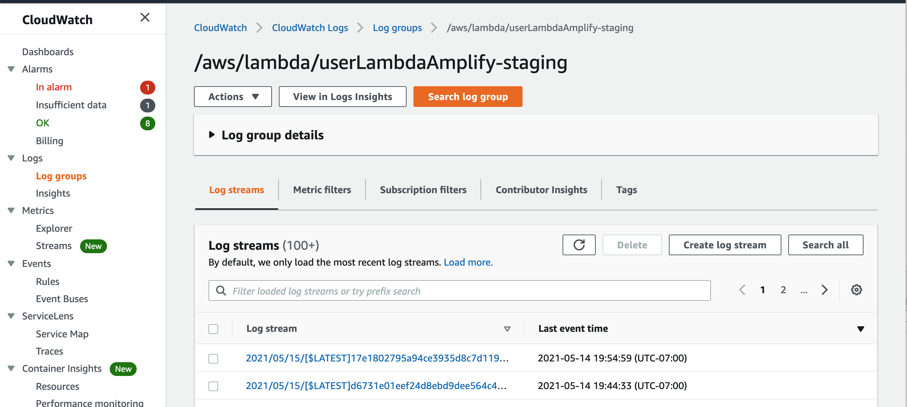

# 282_cloud_services
282 Cloud Services @ SJSU

[Okta](https://developer.okta.com/code/react/okta_react_sign-in_widget/)\
[Okta Server-Side JWT verification](https://developer.okta.com/blog/2018/07/10/build-a-basic-crud-app-with-node-and-react)\
[okta/okta-oidc-js](https://github.com/okta/okta-oidc-js/tree/master/packages/jwt-verifier)\

[from SQL DB to Dynamo DB](https://aws.amazon.com/dms/?nc=bc&pg=pr)\
[Bulk upload from csv to DynamoDB](https://aws.amazon.com/blogs/database/implementing-bulk-csv-ingestion-to-amazon-dynamodb/)\
[Custom claims for Okta](https://support.okta.com/help/s/article/How-to-add-custom-attributes-of-user-profile-as-claims-in-token?language=en_US)


 [+] Discuss features and architecture
 [+] Create AWS resources
 [+] Move SQL db to DynamoDB
 [+] Discuss API calls
 [+] Discuss third-party solution integration (Google maps?, FBbot)

## Features

## Plan

## AWS tools


## Tools

[Figma](https://www.figma.com/) - UX/UI design

## Integration:
* [Google Maps](https://developers.google.com/maps) - To pin the location
* [Jitsi Meet](https://meet.jit.si/) - For video conference


## UIWireFrames














## AWS Configurations











## Do git the right way

**Main branch is - main**

For each new feature create a new branch (-b stands for that)
```
git checkout -b my_branch
```

Do the work, commit, push to the new branch

```
git add ...
git commit -m "..."
git push
```

Checkout to main and pull last changes
```
git checkout main
git pull
```

Go back to your branch and merge with main
```
git checkout my_branch
git merge main
```
Correct conflicts if any and push them back
```
git add ...
git commit -m "..."
git push
```

Do pull request in github browser version:)
