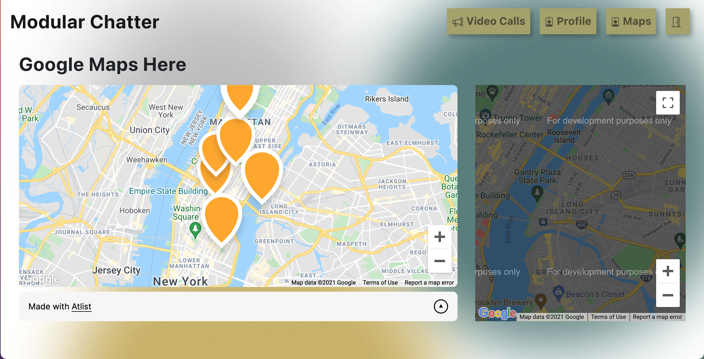

# 282_cloud_services
282 Cloud Services @ SJSU


[Live app](https://main.d19l5z2jndlrkv.amplifyapp.com/) \
[Ppt Slides](https://docs.google.com/presentation/d/1S54imFJ32d3LmO44Qy7cnMpRGOg2ty82vl4iTOVMQ6g/edit?usp=sharing)


Test it:
* Admin: dmitri.baba@modularchat.com [1qa2ws3eD]
* Employees:
  * gro.acton@modularchat.com [1qa2ws3eD]
  * mabhin.anandan@modularchat.com [1qa2ws3eD]

## Features

- Create video meeting
- Search locations on the map
- Update user profile (interests)
- Request profile updates from the admin
- Request custom updates from the admin
- Admin: Accept/Reject user request
- Admin: Search user by id/department

We have implemented multiple microservices for different tasks.\
Each microservice is a REST API (Gateway) + Backend (Lambda) + Database (separate table in the DynamoDB)
Microservices:
* CRUD UserInfo
* CRUD Requests
* Admin manipulations

Rest API are secured by Okta verification (JWT token sent from the front-end).
Additional to such verification for the admin manipulations Okta verifies user group.

## Action Plan

- [x] Discuss features and architecture
- [x] Create AWS resources
- [x] Move SQL db to DynamoDB
- [x] Discuss API calls
- [x] Discuss third-party integration (Google maps)
- [x] Integrate video conference options (Zoom, AWS Chime, jitsi ...)

## AWS tools

* Amplify
* Lambda
* DynamoDB
* Gateway
* CloudWatch

## Other Tools

[Figma](https://www.figma.com/file/KocCuSXhC0QO1FjfDSotkc/Untitled?node-id=0%3A1) - UX/UI design \
[Postman](https://www.postman.com/) - API testing

## Integration:
* [Google Maps](https://developers.google.com/maps) - To pin the location
* [Jitsi Meet](https://meet.jit.si/) - For video conference

## Architecture Diagram


## UIWireFrames
Profile Page


Video Conference Page:
1. Set up the meeting


2. Start/Join the call





## AWS Configurations


## Set Ups

1. Download csv with the raw data from sample db (> 5K records) [link](https://github.com/datacharmer/test_db)
2. Apply updated to the data (we created a dummy email for each record [_firstName_._lastName_@modularchat.com]3.
3. Initiate Amplify project (in the concole and pull it to the local machine)
   ```
   amplify pull --appId [uniqueProjectId] --envName staging
   ```
3. Create AWS resources for userDB, requestDB, etc\
   ```
   amplify add storage (choose - NoSQL)
   amplify add api (choose - REST)
   ampify push
   ```
4. Upload csv in one of the newly created DynamoDB table\
   We created another Lambda function for it. And deployed it using CloudFormationTemplate based on AWS recommendations\
   [CloufFormationTemplate](CSVToDynamo.template)
5. (Optional) Update each row with extra info (we added maxNumber of people allowed for the meeting hosted by the specific employee)\
   [CloudFormationTemplate](UpdateEachRow.template)
6. Create new SPA Application in Okta and
7. Import cvs with userIds, emails, names into Okta
8. Create a rule in Okta that will automatically assign newly imported users to the application
9. Create custom Claim for Okta default server that will allow sent more information with the IDToken (like employeeId, employeeGrouo)\
   Go to Security->API->Edit Authorization Server

## Testing

We tested our API calls using Postman

### Admin calls:
Example: Get all opened custom requests
Authorized:


Authorized but not an Admin


Unauthorized


### UserInfo calls
Authorized:


Unauthorized:


## References

a. [Okta](https://developer.okta.com/code/react/okta_react_sign-in_widget/) \
b. [Okta Server-Side JWT verification](https://developer.okta.com/blog/2018/07/10/build-a-basic-crud-app-with-node-and-react) \
c. [okta/okta-oidc-js](https://github.com/okta/okta-oidc-js/tree/master/packages/jwt-verifier) \
d. [from SQL DB to Dynamo DB](https://aws.amazon.com/dms/?nc=bc&pg=pr) \
e. [Bulk upload from csv to DynamoDB](https://aws.amazon.com/blogs/database/implementing-bulk-csv-ingestion-to-amazon-dynamodb/) \
f. [Custom claims for Okta](https://support.okta.com/help/s/article/How-to-add-custom-attributes-of-user-profile-as-claims-in-token?language=en_US)

## Do git the right way

**Main branch is - main**

For each new feature create a new branch (-b stands for that)
```
git checkout -b my_branch
```

Do the work, commit, push to the new branch

```
git add ...
git commit -m "..."
git push
```

Checkout to main and pull last changes
```
git checkout main
git pull
```

Go back to your branch and merge with main
```
git checkout my_branch
git merge main
```
Correct conflicts if any and push them back
```
git add ...
git commit -m "..."
git push
```

Do pull request in github browser version:)
